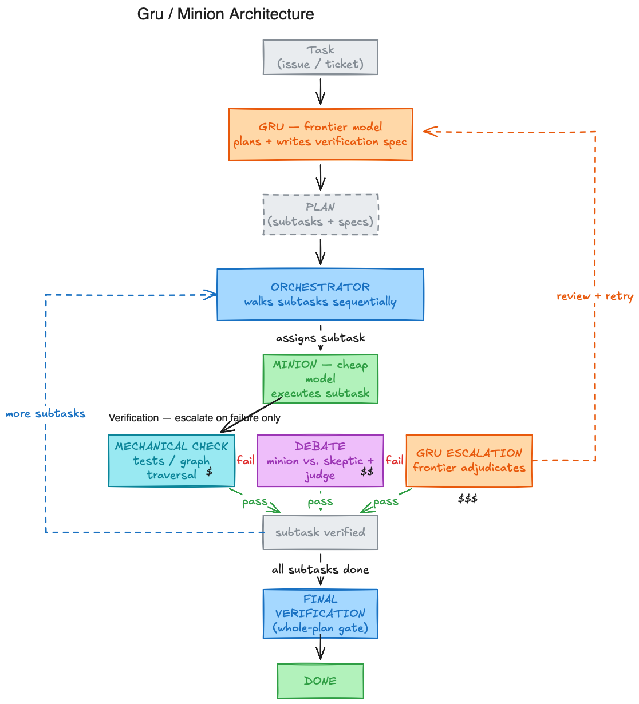

# Gru & Minion

A two-tier agent architecture, tested for whether a cost-aware division of labor between
an expensive planner and a cheap executor actually holds up — measured with real
evaluation harnesses, not the agent's own self-report.

**Gru** is a frontier model that owns a task end to end: diagnosis, decisions, and
whether the result is actually correct. **Minion** is a cheap model Gru can delegate
bounded, well-specified pieces of work to — a search, a file edit, an investigation —
and get a report back. Nothing in the harness forces delegation; Gru decides, per step,
whether a piece of work is worth handing off. The two things this project measures:

1. How much of a session's real token/dollar cost moves to the minion when that choice
   is left alone.
2. Whether it moves without taking accuracy with it.

Every result below is a *real* evaluation — the actual SWE-bench test suite, or
exact-match against GAIA's hidden gold answer — never the agent's own self-report of
success.

## Headline findings

| Vendor pair (Gru → minion) | Minion token share |
|---|---|
| Qwen: `qwen3-max` → `qwen3-coder-flash` | **78.6%** |
| GLM: `glm-4.6` → `glm-4.5-air` | **61.6%** (SWE-bench), **69.7%** (GAIA) |
| GPT: `gpt-5-mini` → `gpt-4.1-nano` | **92.3%** |

All three paired never underperformed their own solo baseline, on real SWE-bench
evaluation. A few more findings worth calling out:

| Metric | Result |
|---|---|
| GAIA resolve rate, same pair, vendor swap only | **14% → 52%** |
| Self-caught infra bugs, fixed pre-publish | **3** |
| Delegation driver (12-run prompt ablation) | task-fit, not wording forcefulness |

Detail behind the last two rows:

- **Delegation ablation**: persona framing, a negative constraint ("forbidden from grunt
  work"), and a "trust your peers" instruction all failed alone; a rule tied to the
  task's actual workflow worked. Trajectory excerpts:
  [`exp4/NOTES.md`](experiments/exp4/NOTES.md),
  [`exp4/DELEGATION_FAILURE_MODES.md`](experiments/exp4/DELEGATION_FAILURE_MODES.md).
- **Bugs caught pre-publish**: a patch-extraction bug hiding correct sessions as
  failures, a cost-tracking gap making a dollar cap a no-op for some models, and a
  self-authored prompt divergence mid-experiment — caught, and the confounded batch
  deleted and rerun rather than kept.

## Architecture



Two tools drive everything: `delegate_to_minion` (hand off a bounded piece of work,
either "findings" — investigate and report back — or "verdict" — do it and self-verify)
and `run_check` (Gru's own independently re-run verification, never trusting a minion's
self-report of success — the "verifiability trap": once a real mechanical check has
settled a result, Gru trusts the check, not the report). The tool schema and shared
prompt fragments (`orchestrator/gru/prompts/*.md`) are identical across every benchmark
this project targets — only the benchmark module underneath
(`orchestrator/benchmarks/`, which supplies the dataset, the container and what a passing
`finish()` submits) and the per-benchmark `instance_template` change. This is a deliberate
constraint: the point of porting to a new benchmark is to hold the architecture and
prompt fixed and see what moves, not to re-tune the prompt per benchmark.

Built on [`mini-swe-agent`](https://github.com/SWE-agent/mini-swe-agent) and
[`litellm`](https://github.com/BerriAI/litellm) for the underlying agent loop and
model-provider routing.

## Repo layout

```
orchestrator/           Core harness. run_session.py (one entrypoint, any benchmark),
                         session.py (wiring + cost accounting), configs.py.
orchestrator/gru/       The planning role: tool schema, model wrapper, config loading,
                         the benchmark-agnostic action loop, and prompts/ — the shared
                         prompt fragments, the same files across every benchmark.
orchestrator/minion/    The execution role: model wrapper and the delegation runner
                         (oneshot single call vs. agentic bash loop).
orchestrator/benchmarks/    One module per dataset behind a common interface (base.py):
                         swebench.py, gaia.py, plus GAIA's dataset loader, scorer and
                         gaia_sandbox/ (Dockerfile + tools for its network-enabled sandbox).
orchestrator/metrics/   Token, cache, real-cost and localization-coverage accounting.
orchestrator/config/    YAML configs: benchmarks/ (which dataset + which configs a run
                         uses), model kwargs, prompt-fragment lists, tool policy,
                         per-benchmark instance templates (gru.yaml, gaia.yaml, *-solo.yaml).
experiments/exp0 – exp6/    One directory per experiment, each with a NOTES.md write-up,
                         raw trajectories, and real evaluation reports.
scripts/                Batch runner (run_batch.sh + a spec per experiment under
                         batches/), evaluation and artifact-pull helpers.
tests/                  Unit + harness tests (fake environments, no live API calls).
literature-review/      Notes on prior art and related benchmarks.
docs/                   Architecture diagram.
```

## Setup

```bash
python -m venv .venv && source .venv/bin/activate
pip install litellm mini-swe-agent swebench pyyaml requests beautifulsoup4 lxml \
            pandas numpy sympy datasets huggingface_hub
```

Requires API keys for whichever model provider you point at (this project runs
everything through [OpenRouter](https://openrouter.ai)) and, for GAIA, a
[Tavily](https://tavily.com) key for the sandbox's web-search tool and a
Hugging Face token with approved access to the gated GAIA dataset. Copy `.env.example`
to `.env` (never commit a real `.env` — it's gitignored) or export directly:

```bash
export OPENROUTER_API_KEY=...
export TAVILY_API_KEY=...     # GAIA only
export HF_TOKEN=...           # GAIA only, needs approved dataset access
```

## Running a session

SWE-bench:

```bash
python -m orchestrator.run_session --benchmark swe_bench \
  --instance astropy__astropy-14182 \
  --gru-model openrouter/z-ai/glm-4.6 \
  --minion-model openrouter/z-ai/glm-4.5-air \
  --output-dir results/my-run
```

GAIA (needs `orchestrator/benchmarks/gaia_sandbox` built as a local Docker image first):

```bash
python -m orchestrator.run_session --benchmark gaia \
  --instance <gaia-task-id> \
  --gru-model openrouter/google/gemini-3.7-flash \
  --minion-model openrouter/deepseek/deepseek-v3.2 \
  --output-dir results/my-gaia-run
```

`--benchmark` names a spec under `orchestrator/config/benchmarks/`, which is what
decides the dataset, the sandbox and the config files a run uses; `swe_bench_solo` /
`gaia_solo` run Gru with no delegation available at all, for a solo baseline comparison.
Adding a dataset means adding a module under `orchestrator/benchmarks/` and a spec file
— nothing in the runner changes.

A sweep of many instances runs through `scripts/run_batch.sh`, which takes a spec file
naming the instances, the model pairs and the arms (each arm is just a benchmark spec,
so solo-vs-paired is a config choice):

```bash
nohup scripts/run_batch.sh scripts/batches/exp5-cross-vendor.sh > exp5_batch.log 2>&1 &
scripts/evaluate_batch.sh experiments/exp5/results experiments/exp5/reports exp5
```

`orchestrator/analyze_run.py`
turns a batch of result directories into a results table merged against a real
evaluation report.

## Experiments

| # | What it tests |
|---|---|
| exp0 – exp1 | Sanity baseline: does a cheap model fail without a plan or verification, then a solo self-hosted model on real SWE-bench instances. |
| exp2 – exp3 | First Gru/minion split, then a full architecture rewrite: one action per turn, real per-delegation cost visibility, a findings-vs-verdict return-type split. |
| exp4 | Twelve live runs, one instance, one evolving prompt — isolates what actually drives delegation. |
| exp5 | 30-run cross-vendor batch on real SWE-bench instances: three independent model pairs, solo vs. paired. |
| exp6 | Same architecture and prompt, ported to GAIA — a completely different task shape. |

Each has a `NOTES.md` documenting what changed, what the real evaluation said, and what
broke along the way — including the failures, not just the results that worked.

## Relation to [DecisionBench](https://arxiv.org/abs/2605.19099)

This project isn't an answer to DecisionBench — it's a much smaller, single-lab effort
that independently hit three of the eight limitations DecisionBench names about its own
design, before this framing existed, and has data that speaks to them directly: the
inability to isolate orchestration methods from system-prompt priming on τ-bench (exp4's
controlled ablation is exactly that isolation, at small scale); pool-freeze-date pricing
drift (this project hit the same instability independently and switched its primary
metric from dollar share to token share in response); and single-seed variance (this
project offers cross-*pair* replication, not seed replication — a different, narrower
robustness axis, not a substitute). The other five limitations DecisionBench names are
untouched by anything here.
